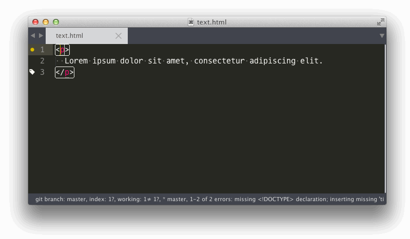

# ST3 Accessibility

A little ST3 package to provide accessibility attributes completion like **WAI ARIA** States and Properties and **Roles**.

## Installation

#### Using [package mangager](https://sublime.wbond.net/installation)

Type "Accessbility" and press enter.

#### Manualy

Clone or Download this repo and place it inside the `Packages` directory. To access, just go to `Sublime text > Preferences > Browse Packages` inside your favorite editor.

## Documentation

More infos about [ARIA States and Properties](http://www.w3.org/TR/wai-aria/states_and_properties). And check this [page](http://www.w3.org/TR/wai-aria/roles) to know more about Roles.

## Contribution

Don't hesitate to help us by commenting this repository or making pull request.

## Credits

Based on the [AngularJS](https://github.com/angular-ui/AngularJS-sublime-package) package.

